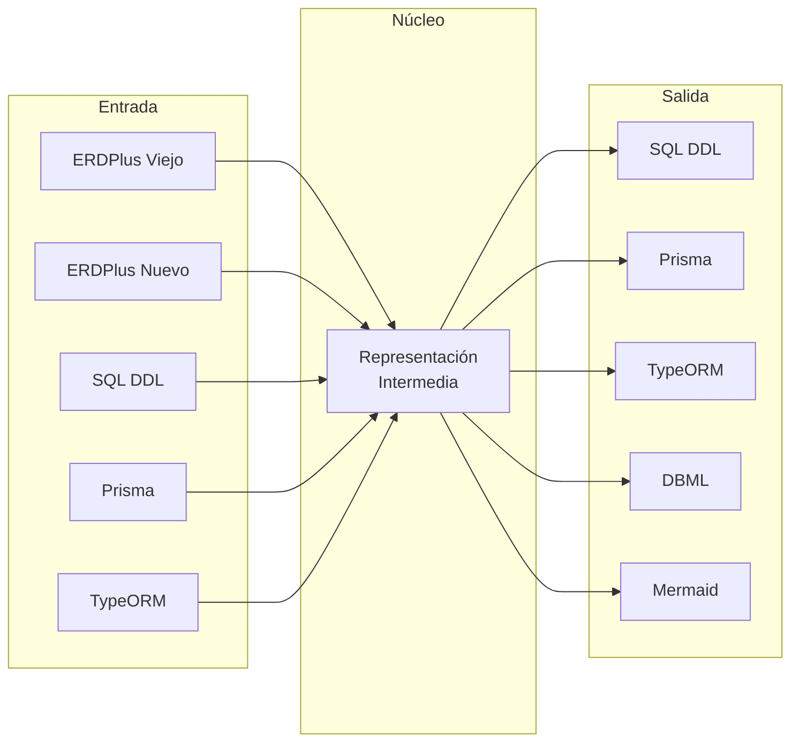
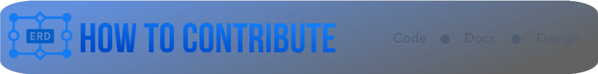

<div align="center">

[](https://erdus-inky.vercel.app)

  <!-- Social -->
  <p style="margin-top:20px;">
    <a href="https://github.com/tobiager">
      
    </a>
    <a href="https://github.com/tobiager/Erdus/stargazers">
      
    </a>
    <a href="https://github.com/tobiager/UNNE-LSI/network/members">
      
    </a>
  </p>
  


<a href="https://www.producthunt.com/products/erdus?embed=true&utm_source=badge-featured&utm_medium=badge&utm_source=badge-erdus" target="_blank"></a>

</div>

# Erdus
### Conversor Universal de Diagramas ER


[También disponible en inglés](README.md) ✦ [Demo](https://erdus-inky.vercel.app) ✦ [Docs](https://deepwiki.com/tobiager/Erdus) ✦ [Contribuir](#contribuir) ✦ [Hoja de ruta](#hoja-de-ruta--conversor-universal)

**Una RI para mapearlos a todos.** Erdus es el **conversor universal de código abierto** para diagramas ER y esquemas de bases de datos.

Unifica ERDPlus, SQL DDL, Prisma, TypeORM, JSON Schema y más bajo una estricta **Representación Intermedia (RI)**.

Construye una vez, convierte en todas partes.


https://github.com/user-attachments/assets/ad18f7ab-0b26-4033-9eae-6a9b209543b8

- **100% del lado del cliente (privacidad)**: los archivos nunca salen del navegador.
- **Entrada**: archivos `.erdplus` o `.json` (formato detectado automáticamente).
- **Salida**: archivo con la extensión correspondiente al formato destino deseado (ej. `nombre-viejo.erdplus`, `schema.sql`, `schema.prisma`).
- **Relaciones**: dibuja un solo enlace por cada FK (incluyendo compuestas) y lo ancla a las columnas hijas reales.

**Módulos disponibles**
- ERDPlus Viejo ⇄ Nuevo (incluido)
- SQL (PostgreSQL DDL)
- Prisma
- TypeORM (RI → modelos de entidad)
- DBML (para dbdiagram.io)
- Mermaid ER (para documentación)

---

## Estructura del proyecto
```
Erdus/
├──  src/                    # Código fuente principal de la aplicación
│   ├──  converters/         # Módulos de conversión de formato
│   ├──  components/         # Componentes UI de React
│   ├──  pages/              # Páginas de la aplicación
│   ├──  utils/              # Funciones de utilidad
│   ├──  types/              # Definiciones de TypeScript
│   └──  docs/               # Documentación dentro de la app
├──  examples/               # Esquemas de ejemplo y conversiones
│   ├──  blog/               # Ejemplo de sistema de blog
│   ├──  ecommerce/          # Esquema de e-commerce
│   └──  school/             # Sistema educativo
├──  tests/                  # Suite de pruebas completa
├──  docs/                   # Sitio web de documentación (Docusaurus)
├──  public/                 # Recursos estáticos
└──  assets/                 # Imágenes y media del README
```

---

## Formatos Soportados

<div align="center">

### Formatos de Entrada → Representación Intermedia → Formatos de Salida



</div>

| Formato | Entrada | Salida | Caso de Uso |
|---------|:-------:|:------:|-------------|
| **ERDPlus** | ✅ | ✅ | Proyectos educativos, diseño visual |
| **SQL DDL** | ✅ | ✅ | Creación de bases de datos, migraciones |
| **Prisma** | ✅ | ✅ | Desarrollo moderno en Node.js |
| **TypeORM** | ✅ | ✅ | Aplicaciones empresariales en TypeScript |
| **DBML** | — | ✅ | Documentación con dbdiagram.io |
| **Mermaid** | — | ✅ | Archivos README, documentación técnica |

---

##  Demo
- Producción: **https://erdus-inky.vercel.app**
- StackBlitz: [Sandbox interactivo](https://stackblitz.com/github/tobiager/Erdus)

> [!TIP]
> En ERDPlus (versión nueva) elige **Menú → Restaurar → Subir** para abrir el archivo convertido. Las posiciones, tipos, restricciones y conexiones permanecen intactas.

---

##  Características del módulo ERDPlus
- **Detección automática** del formato de entrada (viejo o nuevo).
- **Viejo → Nuevo**: tablas → *nodos*, atributos → *columnas*, FKs simples o compuestas → un solo *borde* agrupado con `foreignKeyGroupId` estable.
- **Nuevo → Viejo**: *bordes* → atributos FK y `conectores` con `fkSubIndex` para preservar el orden.
- **IDs determinísticos** para columnas en NUEVO (`c-<tableId>-<attrId>`) permitiendo a ERDPlus anclar líneas y etiquetar columnas como **(FK)**.
- **Privacidad por diseño**: todo el procesamiento ocurre localmente; no hay backend ni subida de archivos.
- **Funciona en Windows, macOS y Linux**. El servidor de desarrollo de Vite proporciona HMR instantáneo.

<details>
<summary>##  Módulo ERDPlus: cómo funciona</summary>

### Viejo → Nuevo (visuales idénticos)
1. Lee las tablas `shapes[]` y crea nodos con `id = t-<id>` y columnas `id = c-<tableId>-<attrId>`.
2. Reconstruye FKs priorizando `connectors[]` (fuente de verdad en Viejo).
   - Agrupa por (hijo → padre), **ordena por `fkSubIndex`** y genera un solo borde por FK compuesta.
   - Usa el ID real de la columna hija en `foreignKeyProps.columns[].id`; ERDPlus dibuja la línea y etiqueta *(FK)*.
3. Asigna un `foreignKeyGroupId` estable basado en el hijo, padre y conjunto ordenado de atributos.

### Nuevo → Viejo (estructura equivalente)
1. Convierte nodos y columnas a tablas y atributos preservando PK, UNIQUE, NULL y tipos.
2. De cada borde crea atributos FK en la tabla hija con `references` apuntando a la PK del padre y `fkSubIndex` siguiendo el orden de columnas del borde.
3. Crea `conectores` por columna FK para que los visualizadores legacy puedan dibujar las conexiones.

> **Garantías**
> - Viaje de ida y vuelta **viejo → nuevo → viejo** sin pérdida: estructura, claves, orden y posiciones se preservan.
> - Viaje de ida y vuelta **nuevo → viejo → nuevo**: nodos, bordes y columnas FK se preservan.
> - El JSON "nuevo" puede diferir en IDs internos invisibles pero es visual y semánticamente equivalente.

</details>

##  Características del módulo SQL
- Auto-detecta scripts `CREATE TABLE` de PostgreSQL.
- RI ⇔ SQL: convierte la RI canónica a DDL de PostgreSQL y parsea SQL de vuelta a RI.
- Preserva restricciones PK, FK y unique.

<details>
<summary>##  Módulo SQL: cómo funciona</summary>

### SQL → RI
1. Escanea declaraciones `CREATE TABLE` y construye tablas y columnas.
2. Lee cláusulas `FOREIGN KEY` para reconstruir relaciones.

### RI → SQL
1. Itera tablas y columnas para generar definiciones `CREATE TABLE`.
2. Emite `ALTER TABLE` para FKs compuestas e índices.

</details>

##  Características del módulo Prisma
- Auto-detecta archivos de esquema Prisma.
- RI ⇔ Prisma: genera modelos Prisma desde RI y parsea esquemas de vuelta.
- Mapea tipos SQL a escalares y relaciones Prisma.

<details>
<summary>##  Módulo Prisma: cómo funciona</summary>

### Prisma → RI
1. Parsea bloques `model` extrayendo campos, tipos y relaciones.

### RI → Prisma
1. Genera bloques `model` con atributos `@id`, `@unique` y `@relation`.

</details>

##  Características del módulo TypeORM
- Auto-detecta clases de entidad TypeORM.
- RI ⇔ TypeORM: genera modelos de entidad y los parsea de vuelta a RI.
- Mapea tipos SQL a tipos TypeScript y decoradores, preservando relaciones e índices.

<details>
<summary>##  Módulo TypeORM: cómo funciona</summary>

### TypeORM → RI
1. Parsea clases `@Entity` para extraer columnas y relaciones.
2. Reconstruye enlaces `@ManyToOne`/`@OneToMany` vía `@JoinColumn`, marcando campos opcionales.

### RI → TypeORM
1. Emite clases `@Entity` con decoradores `@Column`, `@PrimaryColumn` y `@PrimaryGeneratedColumn`.
2. Genera relaciones `@ManyToOne`/`@OneToMany` y declaraciones `@Index`.
3. Mapea tipos SQL a tipos TypeORM y añade opciones nullable/unique.

</details>

---

## Código abierto y escalable

- Licenciado bajo MIT con un núcleo ligero y modular.
- Nuevos convertidores o exportadores pueden conectarse como módulos simples.
- Incluye CLI y API mínima para que encaje en pipelines CI/CD, funciones serverless o clusters de contenedores.

---

## Inicio Rápido

### Interfaz Web (Recomendado)

Comienza en segundos con nuestra interfaz web:

1. **Visita** [erdus-inky.vercel.app](https://erdus-inky.vercel.app)
2. **Sube** tu diagrama ER o archivo de esquema
3. **Selecciona** tu formato de salida deseado
4. **Descarga** el resultado convertido

### Instalación Local

Para desarrollo o uso sin conexión:

```bash
# Clonar e instalar
git clone https://github.com/tobiager/Erdus.git
cd Erdus
npm install --legacy-peer-deps

# Iniciar servidor de desarrollo
npm run dev
# → Abrir http://localhost:5173
```

### Uso Programático

```typescript
import { erdplusToIR, irToSQL, irToPrisma } from 'erdus';

// Convertir ERDPlus a SQL
const erdplusData = JSON.parse(fileContent);
const schema = erdplusToIR(erdplusData);
const sqlScript = irToSQL(schema);

// O convertir a Prisma
const prismaSchema = irToPrisma(schema);
```

### Recursos de Desarrollo

- [**Guía de Contribución**](CONTRIBUTING.md) - Proceso detallado de contribución
- [**Configuración de Desarrollo**](DEVELOPMENT.md) - Guía de desarrollo local
- [**Arquitectura**](docs/docs/architecture.md) - Descripción del diseño del sistema
- [**Documentación de API**](API.md) - Guía de uso programático
  
---

## Probando la conversión
1. Abre la aplicación local en `http://localhost:5173`.
2. Arrastra o selecciona un archivo `.erdplus` (viejo o nuevo) y presiona **Convertir**.
3. `*-new.erdplus` o `*-old.erdplus` se descargará automáticamente según corresponda.
4. En ERDPlus nuevo: **Restaurar → Subir** para verificar que el diagrama es idéntico.

En Windows/PowerShell, si aparecen conflictos de dependencias pares, fija ESLint 8.57:
```bash
npm i -D eslint@8.57.0
npm i
```

---

##  Desplegar en Vercel
1. Importa el repositorio (Framework: **Vite**).
2. Build: `npm run build`
3. Directorio de salida: `dist/`

`vercel.json` ya apunta a `dist/`.

---

## Privacidad y seguridad
- El procesamiento ocurre completamente en tu navegador.
- No se envían archivos a ningún servidor, ni siquiera a Vercel.
- Puedes usarlo sin conexión con `npm run build` seguido de `npm run preview`.

---

##  Limitaciones conocidas
- ERDPlus (versión nueva) puede enrutar líneas de manera diferente (curvas) pero las conexiones y cardinalidades son correctas.
- Si tu archivo NUEVO viene de otra herramienta con IDs propietarios, el conversor no clonará esos IDs. Son invisibles y no afectan el renderizado.

---

##  Hoja de ruta — Conversor Universal

 **Fase 0 – Lo que existe hoy (base)**

- ERDPlus viejo ⇄ nuevo
- ✅ Soporte completo para PK, FK, grupos únicos
- ✅ Viaje de ida y vuelta sin pérdidas
-  Audiencia: estudiantes, profesores, ejercicios universitarios

---

 **Fase 1 – MVP "Útil + viral"**

 *Objetivo*: cualquiera puede usarlo en línea y obtener valor inmediatamente

- RI canónica (v1) → núcleo
- ✅ RI → PostgreSQL DDL → generar `CREATE TABLE` real
- ✅ RI → esquema Prisma → conectar con Next.js/TypeScript
- ✅ Demo web (Vercel) → arrastrar y soltar, pestañas de resultado, reporte de pérdidas
- ✅ CLI simple (`erdus convert ...`)
-  Atrae: desarrolladores fullstack, indie hackers, estudiantes → primeras estrellas

---

 **Fase 2 – Importación y documentación** 

 *Objetivo*: importar modelos existentes y documentarlos

- ✅ PostgreSQL DDL → RI (parser robusto)
- ✅ RI → dbml → usar en dbdiagram.io
- ✅ RI → Mermaid ER → documentar en Markdown/repos
- ✅ Ejemplos completos (blog, e‑commerce, escuela)
-  Atrae: desarrolladores que documentan, mantenedores OSS → visibilidad en GitHub

---

 **Fase 3 – Ecosistema de desarrolladores**

 *Objetivo*: ser útil en pipelines y proyectos serios

- RI → JSON Schema (APIs, validación)
- ✅ RI → modelos TypeORM
- RI → modelos Sequelize
- RI → esquema Supabase (+ políticas RLS opcionales)
- Plan Diff/Migración: comparar dos RI → script SQL `ALTER`
-  Atrae: startups, proyectos SaaS → estrellas de gente productiva

---

 **Fase 4 – Características avanzadas / definitivas**

 *Objetivo*: expandir a NoSQL y APIs modernas

- RI ↔ esquemas Mongoose (MongoDB)
- RI ↔ esquemas OpenAPI
- RI ↔ GraphQL SDL
- Visualizador: editor web básico con vista ERD interactiva
-  Atrae: desarrolladores modernos, comunidad API/GraphQL
-  Aquí es donde ERDUS podría convertirse en el estándar OSS

---

 **Orden de lanzamiento recomendado**

1. Fase 1 (MVP): Postgres + Prisma + demo web (valor rápido, viral)
2. Fase 2: Documentación (dbml/Mermaid) → viralidad en GitHub/Reddit
3. Fase 3: JSON Schema + Supabase + Diff → desarrolladores serios
4. Fase 4: MongoDB + GraphQL + Visualizador → consolidación de suite universal

---

 **Estrategia de crecimiento**

- Cada fase = un lanzamiento con changelog y post en Reddit/HN/Twitter
- README con GIFs cortos (arrastrar y soltar, salida instantánea)
- Badges CI + demo en línea → confianza
- "Good first issues" para invitar PRs → comunidad

---

## Contribuir

[](CONTRIBUTING.md)

Por favor lee la [Guía de Contribución](CONTRIBUTING.md) antes de comenzar.

1. Haz fork y crea una rama `feat/mi-mejora`.  
2. Ejecuta `npm i` y `npm run dev`.  
3. Incluye un archivo `.erdplus` de ejemplo cuando sea relevante.  
4. Abre un PR — ¡las contribuciones son bienvenidas!  

---

## Principales Contribuyentes

Gracias a todos los que contribuyen al crecimiento de este proyecto. ¡Tu contribución también puede estar incluida aquí!

<p align="center">
  <a href="https://github.com/tobiager/erdus/graphs/contributors">
  
</a>
</p>

---

## Licencia

MIT — ver [LICENSE](LICENSE).
