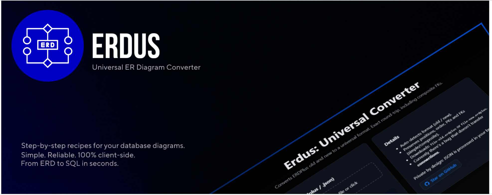
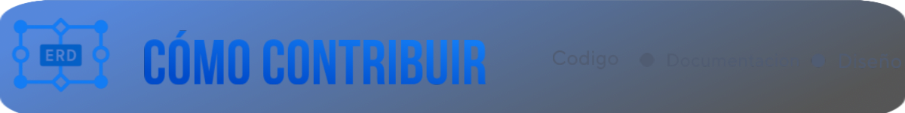

<div align="center">

[](https://erdus-inky.vercel.app)

# Erdus
### Conversor universal de diagramas ER


[Disponible en inglés](README.md) ✦ [Demo](https://erdus-inky.vercel.app) ✦ [Docs](#) ✦ [Contribuir](#-contribuyendo) ✦ [Roadmap](#%EF%B8%8F-roadmap-erdus--conversor-universal)

**One IR to map them all.** Erdus es el **conversor universal open source** para diagramas ER y esquemas de bases de datos.  
Unifica ERDPlus, SQL DDL, Prisma, JSON Schema y más bajo una estricta **Representación Intermedia (IR)**.  
Construí una vez, convertí en cualquier lugar. 🚀

</div>

<br>

<div align="center">


</div>


- **100% en el cliente (privacidad)**: los archivos nunca salen del navegador.  
- **Entrada**: archivos `.erdplus` o `.json` (el formato se detecta automáticamente).  
- **Salida**: archivo con la extensión que corresponda al formato de destino deseado (por ejemplo, `name-old.erdplus`, `schema.sql`, `schema.prisma`).  
- **Relaciones**: dibuja un único enlace por cada FK (incluyendo compuestas) y lo ancla a las columnas hijas reales.  

**Módulos disponibles**
- ERDPlus Old ⇄ New (incluido)
- SQL (DDL de PostgreSQL)
- Prisma

---

## 📁 Estructura del proyecto
```
├─ src/
│  ├─ app.ts           # UI: drag & drop, input de archivo, descarga
│  ├─ convert.ts       # lógica de conversión old ⇄ new (sin pérdida)
│  └─ types.ts         # tipos para ambos formatos (Old/New)
├─ public/
│  └─ favicon.svg
├─ index.html          # landing mínima + dropzone
├─ vite.config.ts
├─ tsconfig.json
├─ vercel.json
├─ README.md
└─ LICENSE
```

---

##  Demo
- Producción: **https://erdus-inky.vercel.app**
- StackBlitz: [Sandbox interactivo](https://stackblitz.com/github/tobiager/Erdus)

> [!TIP]
> En ERDPlus (versión nueva) elegí **Menu → Restore → Upload** para abrir el archivo convertido.  
> Las posiciones, tipos, restricciones y conexiones se mantienen intactas.

---

##  Características del módulo ERDPlus
- **Detección automática** del formato de entrada (old o new).  
- **Old → New**: tablas → *nodes*, atributos → *columns*, FKs simples o compuestas → un único *edge* agrupado con `foreignKeyGroupId`.  
- **New → Old**: *edges* → atributos FK y `connectors` con `fkSubIndex` para mantener el orden.  
- **IDs determinísticos** para columnas en NEW (`c-<tableId>-<attrId>`) que permiten a ERDPlus anclar líneas y marcar columnas como **(FK)**.  
- **Privado por diseño**: todo el procesamiento ocurre localmente, no hay backend ni subida de archivos.  
- **Funciona en Windows, macOS y Linux**. El servidor de Vite provee HMR instantáneo.  

<details>
<summary>##  ERDPlus module: cómo funciona</summary>

### Old → New (visuales idénticos)
1. Lee las tablas en `shapes[]` y crea nodos con `id = t-<id>` y columnas `id = c-<tableId>-<attrId>`.  
2. Reconstruye las FKs priorizando `connectors[]` (fuente de verdad en Old).  
   - Agrupa por (hijo → padre), **ordena por `fkSubIndex`** y genera un único edge por FK compuesta.  
   - Usa el ID real de la columna hija en `foreignKeyProps.columns[].id`; ERDPlus dibuja la línea y etiqueta *(FK)*.  
3. Asigna un `foreignKeyGroupId` estable basado en hijo, padre y el conjunto ordenado de atributos.  

### New → Old (estructura equivalente)
1. Convierte nodos y columnas a tablas y atributos preservando PK, UNIQUE, NULL y tipos.  
2. De cada edge crea atributos FK en la tabla hija con `references` apuntando a la PK del padre y `fkSubIndex` siguiendo el orden.  
3. Crea `connectors` por columna FK para que los visores legacy dibujen las conexiones.  

> **Garantías**  
> - Round-trip **old → new → old** sin pérdida: estructura, claves, orden y posiciones se preservan.  
> - Round-trip **new → old → new**: nodos, edges y columnas FK se preservan.  
> - El JSON “new” puede diferir en IDs internos invisibles pero es visual y semánticamente equivalente.  

</details>

##  Características del módulo SQL
- Detecta automáticamente scripts `CREATE TABLE` de PostgreSQL.
- IR ⇔ SQL: convierte la IR canónica a DDL de PostgreSQL y parsea SQL a IR.
- Preserva claves primarias, foráneas y únicas.

<details>
<summary>##  Módulo SQL: cómo funciona</summary>

### SQL → IR
1. Escanea sentencias `CREATE TABLE` y arma tablas y columnas.
2. Lee cláusulas `FOREIGN KEY` para reconstruir relaciones.

### IR → SQL
1. Recorre tablas y columnas para emitir definiciones `CREATE TABLE`.
2. Genera `ALTER TABLE` para FKs compuestas e índices.

</details>

##  Características del módulo Prisma
- Detecta automáticamente archivos de esquema Prisma.
- IR ⇔ Prisma: genera modelos Prisma a partir de la IR y parsea esquemas de vuelta.
- Mapea tipos SQL a escalares y relaciones de Prisma.

<details>
<summary>##  Módulo Prisma: cómo funciona</summary>

### Prisma → IR
1. Parsea bloques `model` extrayendo campos, tipos y relaciones.

### IR → Prisma
1. Genera bloques `model` con atributos `@id`, `@unique` y `@relation`.

</details>

---

## 👐 Open source & escalable
- Licencia MIT con núcleo modular y liviano.  
- Nuevos conversores o exportadores se pueden enchufar como módulos simples.  
- Incluye CLI y API mínima para integrarse en pipelines CI/CD, funciones serverless o contenedores.  

---

## 🚀 Uso local

### Requisitos
- **Node 18+** (20+ recomendado)  
- **npm** o **pnpm**  

### Pasos
```bash
# instalar dependencias
npm i
# o con pnpm:
# corepack enable && corepack prepare pnpm@8 --activate
# pnpm i

# ejecutar en modo desarrollo
npm run dev
# (abre http://localhost:5173)

# build de producción
npm run build

# previsualizar el build
npm run preview
```

---

## ☁️ Deploy en Vercel
1. Importá el repositorio (Framework: **Vite**).
2. Build: `npm run build`
3. Directorio de salida: `dist/`

El archivo `vercel.json` ya apunta a `dist/`.


---

## 🔒 Privacidad y seguridad
- El procesamiento se realiza completamente en tu navegador.
- No se envían archivos a ningún servidor, ni siquiera a Vercel.
- Podés usarlo offline con `npm run build` seguido de `npm run preview`.

---

## 🧭 Limitaciones conocidas
- ERDPlus (versión new) puede enrutar las líneas de forma distinta (curvas), pero las conexiones y cardinalidades son correctas.
- Si tu archivo NEW proviene de otra herramienta con IDs propietarios, el conversor no clonará esos IDs. No son visibles y no afectan el render.

---

## 🗺️ Roadmap ERDUS — Conversor Universal

🟢 **Fase 0 – Lo que ya existe (base)**

- ERDPlus old ⇄ new
- ✔️ Soporte completo de PK, FK, unique groups
- ✔️ Round-trip lossless
-  Público: estudiantes, profes, ejercicios de facu

---

🟡 **Fase 1 – MVP “útil + viral”**

 *Objetivo*: hacer que cualquiera lo pueda usar online y le sirva YA

- IR canónico (v1) → núcleo
- ✔️ IR → PostgreSQL DDL → generar `CREATE TABLE` real
- ✔️ IR → Prisma schema → conectar con Next.js/TS
- ✔️ Web demo (Vercel) → drag & drop + pestañas con resultados + loss report
- ✔️ CLI simple (`erdus convert ...`)
-  Atrae: fullstackers, devs indie, estudiantes → primeras ⭐

---

🔵 **Fase 2 – Import & documentación**

 *Objetivo*: importar modelos existentes y documentarlos

- PostgreSQL DDL → IR (parser robusto)
- IR → dbml → usar en dbdiagram.io
- IR → Mermaid ER → documentar en Markdown/repos
- Ejemplos completos (blog, e‑commerce, escuela)
-  Atrae: devs que documentan, OSS maintainers → visibilidad en GitHub

---

🟣 **Fase 3 – Ecosistema dev**

 *Objetivo*: ser útil en pipelines y proyectos serios

- IR → JSON Schema (APIs, validación)
- IR → TypeORM/Sequelize models
- IR → Supabase schema (+ políticas RLS opcionales)
- Diff/Migration plan: comparar dos IR → script SQL `ALTER`
-  Atrae: startups, proyectos SaaS → estrellas de gente productiva

---

🔴 **Fase 4 – Advanced / killer features**

 *Objetivo*: expandirse a NoSQL y APIs modernas

- IR ↔ Mongoose schemas (MongoDB)
- IR ↔ OpenAPI schemas
- IR ↔ GraphQL SDL
- Visualizer: editor web básico con vista ERD interactiva
-  Atrae: devs modernos, comunidad API/GraphQL
-  Este es el punto donde se puede volver referencia estándar OSS

---

📈 **Orden de salida recomendado**

1. Fase 1 (MVP): Postgres + Prisma + web demo (rápido valor, viral)
2. Fase 2: Documentación (dbml/Mermaid) → viralidad en GitHub/Reddit
3. Fase 3: JSON Schema + Supabase + Diff → devs serios
4. Fase 4: MongoDB + GraphQL + Visualizer → consolidación como suite universal

---

🌟 **Estrategia de crecimiento**

- Cada fase = un release con changelog y post en Reddit/HN/Twitter
- README con GIFs cortos (drag & drop, output instantáneo)
- Badges de CI + demo online → confianza
- Good first issues para invitar a PRs → comunidad

---

## 🤝 Contribuyendo

[](CONTRIBUTING.es.md)

Lee la [Guía de Contribución](CONTRIBUTING.es.md) antes de empezar.

1. Bifurca y crea una rama `feat/my-improvement`.
2. Ejecuta `npm i` y `npm run dev`.
3. Incluye un archivo `.erdplus` de ejemplo cuando sea necesario.
4. Abre una solicitud de colaboración (PR). ¡Agradecemos tus contribuciones!

---

## 🧪 Testing (opcional)

Si activás los tests (Vitest), podés validar los round‑trips:
```bash
npm run test
```
- **old → new → old**: deben conservarse tablas, atributos, posiciones y claves.
- **new → old → new**: deben conservarse nodos, *edges* y columnas FK.

---

## ❓ FAQ

**¿El conversor sube mis archivos?** No, todo corre en tu navegador.

**¿Funciona con claves foráneas compuestas?** Sí, soporta FKs múltiples sin perder información.

---

## 🤝🏻 Principales contribuidores

Gracias a todas las personas que contribuyen al crecimiento de este proyecto. ¡Tu contribución también puede aparecer aquí!

<p align="center">
  <a href="https://github.com/tobiager/erdus/graphs/contributors">
    
  </a>
</p>

---

## 📝 Licencia

MIT — ver [LICENSE](LICENSE).
