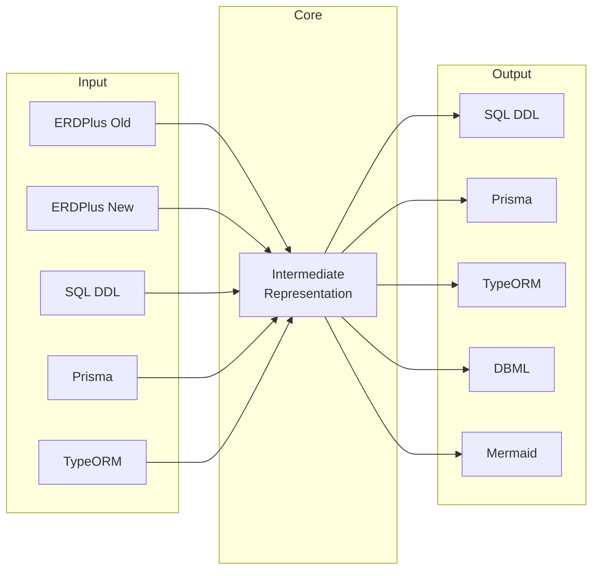

<div align="center">

[](https://erdus-inky.vercel.app)

# Erdus
### Universal ER Diagram Converter

**The open-source tool that bridges the gap between database design and implementation.**

Transform your Entity-Relationship diagrams into production-ready code with zero data loss.

[](https://github.com/tobiager/Erdus/stargazers)
[](LICENSE)
[](https://erdus-inky.vercel.app)


<a href="https://www.producthunt.com/products/erdus?embed=true&utm_source=badge-featured&utm_medium=badge&utm_source=badge-erdus" target="_blank"></a>

[🚀 **Try Live Demo**](https://erdus-inky.vercel.app) • [📖 **Documentation**](https://tobiager.github.io/Erdus/) • [🤝 **Contributing**](CONTRIBUTING.md) • [🗺️ **Roadmap**](#roadmap)

https://github.com/user-attachments/assets/ad18f7ab-0b26-4033-9eae-6a9b209543b8

</div>

## Table of Contents

- [✨ Features](#-features)
- [🚀 Quick Start](#-quick-start)
- [🔄 Supported Formats](#-supported-formats)
- [🏗️ How It Works](#️-how-it-works)
- [💡 Use Cases](#-use-cases)
- [📁 Project Structure](#-project-structure)
- [🛠️ Development](#️-development)
- [🗺️ Roadmap](#️-roadmap)
- [🤝 Contributing](#-contributing)
- [📄 License](#-license)

## ✨ Features

<div align="center">

| 🔒 **Privacy First** | 🔄 **Universal Conversion** | ⚡ **Blazing Fast** |
|:---:|:---:|:---:|
| 100% client-side processing<br/>Your files never leave your browser | Convert between 6+ formats<br/>Lossless round-trip conversions | Instant conversion<br/>Offline capable |

| 🎯 **Developer Friendly** | 🧩 **Extensible** | 📚 **Well Documented** |
|:---:|:---:|:---:|
| TypeScript, React, Modern stack<br/>Comprehensive API | Plugin architecture<br/>Easy to add new formats | Detailed guides & examples<br/>Community support |

</div>

### Core Capabilities

- **🔄 Bidirectional Conversion**: Convert between any supported format pair
- **🔐 Privacy by Design**: All processing happens locally in your browser
- **📊 Composite Foreign Keys**: Full support for complex database relationships
- **🎨 Visual Preservation**: Maintains layouts and positioning where possible
- **⚡ Format Detection**: Automatic input format recognition
- **🧪 Round-trip Validation**: Guarantees structural integrity
- **📱 Cross-Platform**: Works on Windows, macOS, Linux, and mobile browsers

## 🚀 Quick Start

### Web Interface (Recommended)

Get started in seconds with our web interface:

1. **Visit** [erdus-inky.vercel.app](https://erdus-inky.vercel.app)
2. **Upload** your ER diagram or schema file
3. **Select** your desired output format
4. **Download** the converted result

### Local Installation

For development or offline use:

```bash
# Clone and install
git clone https://github.com/tobiager/Erdus.git
cd Erdus
npm install --legacy-peer-deps

# Start development server
npm run dev
# → Open http://localhost:5173
```

### Programmatic Usage

```typescript
import { erdplusToIR, irToSQL, irToPrisma } from 'erdus';

// Convert ERDPlus to SQL
const erdplusData = JSON.parse(fileContent);
const schema = erdplusToIR(erdplusData);
const sqlScript = irToSQL(schema);

// Or convert to Prisma
const prismaSchema = irToPrisma(schema);
```

## 🔄 Supported Formats

<div align="center">

### Input Formats → Intermediate Representation → Output Formats



</div>

| Format | Input | Output | Use Case |
|--------|:-----:|:------:|----------|
| **ERDPlus** | ✅ | ✅ | Educational projects, visual design |
| **SQL DDL** | ✅ | ✅ | Database creation, migrations |
| **Prisma** | ✅ | ✅ | Modern Node.js development |
| **TypeORM** | ✅ | ✅ | Enterprise TypeScript apps |
| **DBML** | — | ✅ | Documentation with dbdiagram.io |
| **Mermaid** | — | ✅ | README files, technical docs |

## 🏗️ How It Works

Erdus uses a sophisticated three-stage conversion process:

```
1. PARSE → 2. NORMALIZE → 3. GENERATE
```

### 1. Intelligent Parsing
- **Format Detection**: Automatically identifies input format
- **Structure Analysis**: Extracts tables, columns, and relationships
- **Validation**: Ensures data integrity and completeness

### 2. Intermediate Representation
- **Unified Schema**: Common format for all database structures
- **Relationship Preservation**: Maintains foreign key relationships
- **Metadata Retention**: Keeps positioning and styling information

### 3. Smart Generation
- **Format-Specific Output**: Generates idiomatic code for each target
- **Best Practices**: Follows conventions for each framework
- **Optimization**: Produces clean, readable output

### ERDPlus Conversion Features

<details>
<summary><strong>🔄 ERDPlus Old ↔ New (Click to expand)</strong></summary>

**Old → New Conversion:**
- Tables → nodes with stable IDs (`t-<id>`)
- Attributes → columns with deterministic IDs (`c-<tableId>-<attrId>`)
- Composite FKs → single grouped edges with `foreignKeyGroupId`
- Preserves visual layout and relationships

**New → Old Conversion:**
- Nodes → tables maintaining structure
- Edges → FK attributes with `fkSubIndex` ordering
- Creates `connectors` for legacy compatibility
- Preserves all constraints and relationships

**Round-trip Guarantees:**
- **old → new → old**: Zero data loss, perfect preservation
- **new → old → new**: Semantically equivalent structures
- Visual and structural integrity maintained

</details>

## 💡 Use Cases

### 🎓 Education
- **Database Design Courses**: Convert student submissions
- **Assignment Validation**: Automated schema checking
- **Learning Progression**: Move from visual to code-based design

### 🏢 Enterprise Development  
- **Legacy Migration**: Modernize old ERDPlus designs
- **Team Collaboration**: Bridge design and development teams
- **Documentation**: Generate up-to-date schema documentation

### 🚀 Modern Development
- **Rapid Prototyping**: Quick schema iteration
- **CI/CD Integration**: Automated schema validation
- **Multi-Format Support**: Work with diverse technology stacks

### 📚 Documentation
- **README Diagrams**: Embed Mermaid schemas in documentation
- **API Documentation**: Generate schema references
- **Architecture Diagrams**: Visual database documentation

## 📁 Project Structure

```
Erdus/
├── 📂 src/                    # Core application source
│   ├── 🔄 converters/         # Format conversion modules
│   ├── 🧩 components/         # React UI components  
│   ├── 📄 pages/              # Application pages
│   ├── 🔧 utils/              # Utility functions
│   ├── 📝 types/              # TypeScript definitions
│   └── 📖 docs/               # In-app documentation
├── 📂 examples/               # Example schemas & conversions
│   ├── 📝 blog/               # Blog system example
│   ├── 🛒 ecommerce/          # E-commerce schema
│   └── 🎓 school/             # Educational system
├── 📂 tests/                  # Comprehensive test suite
├── 📂 docs/                   # Documentation website (Docusaurus)
├── 📂 public/                 # Static assets
└── 📊 assets/                 # README images & media
```

## 🛠️ Development

### Prerequisites
- **Node.js 18+** (20+ recommended)
- **npm** or **pnpm** package manager

### Development Commands

```bash
# Development
npm run dev          # Start dev server with hot reload
npm run build        # Build for production
npm run preview      # Preview production build

# Quality Assurance  
npm test            # Run test suite (48+ tests)
npm run lint        # ESLint code checking
npm run typecheck   # TypeScript validation
npm run format      # Prettier code formatting

# Advanced
npm run cli         # Command-line interface
npm run analyze     # Bundle size analysis
```

### Testing

Erdus includes a comprehensive test suite with 48+ tests covering:

- **Unit Tests**: Individual converter functions
- **Integration Tests**: End-to-end conversion workflows  
- **Round-trip Tests**: Bidirectional conversion validation
- **Edge Cases**: Error handling and malformed input

```bash
# Run all tests
npm test

# Run specific test category
npm test -- tests/conversion.test.ts
npm test -- tests/roundtrip.test.ts

# Run with coverage
npm test -- --coverage
```

## 🗺️ Roadmap

Our development is organized into focused phases:

### 🟢 Phase 0: Foundation ✅
- ERDPlus old ⇄ new conversion with zero data loss
- Core IR (Intermediate Representation) architecture
- Web interface with drag & drop functionality

### 🟡 Phase 1: MVP Essentials ✅  
- PostgreSQL DDL support (SQL ↔ IR)
- Prisma schema conversion (Prisma ↔ IR)
- TypeORM entity generation (IR → TypeORM)
- Production web deployment

### 🔵 Phase 2: Documentation & Import ✅
- Robust SQL DDL parser (SQL → IR)
- DBML export for dbdiagram.io integration
- Mermaid ER diagram generation
- Comprehensive example schemas

### 🟣 Phase 3: Developer Ecosystem
- JSON Schema generation for API validation
- Sequelize model support
- Supabase schema generation with RLS policies
- Database migration planning (schema diffing)

### 🔴 Phase 4: Advanced Features
- MongoDB/Mongoose schema support
- OpenAPI specification generation
- GraphQL SDL conversion
- Interactive web-based ERD editor

### 📈 Upcoming Releases

- **v1.1**: Enhanced SQL dialect support (MySQL, SQLite)
- **v1.2**: JSON Schema and OpenAPI generators  
- **v1.3**: MongoDB and NoSQL support
- **v2.0**: Interactive diagram editor

## 🤝 Contributing

We welcome contributions from developers of all experience levels!

### Quick Contribution Guide

1. **🍴 Fork** the repository
2. **🌿 Create** a feature branch (`feat/amazing-feature`)
3. **💻 Code** your changes with tests
4. **✅ Validate** with `npm run lint && npm test`
5. **📝 Commit** using [Conventional Commits](https://conventionalcommits.org/)
6. **🚀 Submit** a pull request

### Ways to Contribute

- 🐛 **Report Bugs**: File detailed issue reports
- ✨ **Request Features**: Suggest new functionality
- 💻 **Submit Code**: Add features or fix bugs
- 📖 **Improve Docs**: Enhance guides and examples
- 🧪 **Add Tests**: Increase test coverage
- 🌍 **Translate**: Add internationalization support

### Development Resources

- [**Contributing Guide**](CONTRIBUTING.md) - Detailed contribution process
- [**Development Setup**](DEVELOPMENT.md) - Local development guide
- [**Architecture**](docs/docs/architecture.md) - System design overview
- [**API Documentation**](API.md) - Programmatic usage guide

<div align="center">

### 🌟 Top Contributors

Thanks to everyone who makes Erdus better!

<a href="https://github.com/tobiager/erdus/graphs/contributors">
  
</a>

*Want to see your avatar here? [Start contributing!](CONTRIBUTING.md)*

</div>

## 📄 License

**MIT License** - see [LICENSE](LICENSE) for details.

This means you can:
- ✅ Use commercially
- ✅ Modify and distribute  
- ✅ Use privately
- ✅ Include in proprietary software

---

<div align="center">

**Made with ❤️ by the open-source community**

[⭐ Star us on GitHub](https://github.com/tobiager/Erdus) • [🐛 Report Issues](https://github.com/tobiager/Erdus/issues) • [💬 Join Discussions](https://github.com/tobiager/Erdus/discussions)

**Erdus** - *Bridging the gap between database design and implementation*

</div>