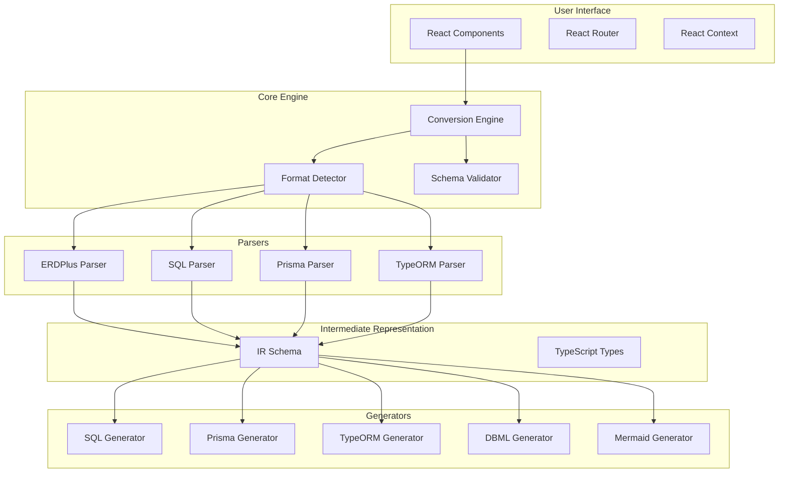
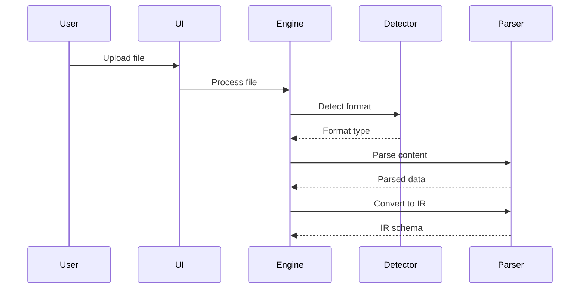
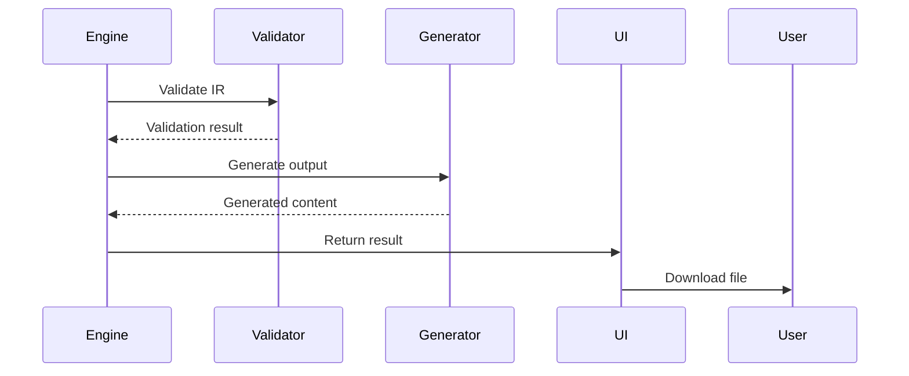

# Architecture

This document provides a comprehensive overview of Erdus's architecture, design principles, and internal workings.

## Overview

Erdus is built as a modern web application with a focus on client-side processing, modularity, and extensibility. The architecture ensures privacy, performance, and maintainability while supporting multiple input and output formats.

## Design Principles

### 1. Privacy by Design
- **Client-side processing**: All conversions happen in the browser
- **No data collection**: Files are never uploaded to servers
- **Offline capability**: Works without internet connection after initial load

### 2. Modular Architecture
- **Separation of concerns**: Clear boundaries between parsing, conversion, and output
- **Plugin-based converters**: Easy to add new format support
- **Reusable components**: Shared utilities across all converters

### 3. Type Safety
- **TypeScript throughout**: Full type coverage for reliability
- **Schema validation**: Runtime type checking for data integrity
- **Interface contracts**: Clear APIs between modules

## System Architecture



## Core Components

### 1. Conversion Engine (`src/convert.ts`)

The heart of Erdus, responsible for orchestrating the conversion process:

```typescript
interface ConversionEngine {
  detectFormat(content: string): FormatType;
  parseInput(content: string, format: FormatType): DatabaseSchema;
  generateOutput(schema: DatabaseSchema, targetFormat: FormatType): string;
  validateSchema(schema: DatabaseSchema): ValidationResult;
}
```

**Responsibilities:**
- Format detection and validation
- Conversion orchestration
- Error handling and reporting
- Round-trip validation

### 2. Format Detector (`src/utils/format-detector.ts`)

Smart detection of input formats based on content analysis:

```typescript
function detectFormat(content: string): FormatType {
  // JSON structure analysis for ERDPlus
  if (isERDPlusFormat(content)) {
    return isOldFormat(content) ? 'erdplus-old' : 'erdplus-new';
  }
  
  // SQL keyword detection
  if (isSQLFormat(content)) {
    return 'sql';
  }
  
  // Prisma schema patterns
  if (isPrismaFormat(content)) {
    return 'prisma';
  }
  
  // TypeORM entity patterns
  if (isTypeORMFormat(content)) {
    return 'typeorm';
  }
  
  return 'unknown';
}
```

### 3. Intermediate Representation (IR)

The common data structure that all formats convert to/from:

```typescript
interface DatabaseSchema {
  tables: Table[];
  relationships: Relationship[];
  metadata?: SchemaMetadata;
}

interface Table {
  id: string;
  name: string;
  columns: Column[];
  indices?: Index[];
  position?: Position;
}

interface Column {
  id: string;
  name: string;
  type: DataType;
  nullable?: boolean;
  primaryKey?: boolean;
  unique?: boolean;
  defaultValue?: string;
  constraints?: Constraint[];
}

interface Relationship {
  id: string;
  type: RelationshipType;
  fromTable: string;
  toTable: string;
  fromColumns: string[];
  toColumns: string[];
  onDelete?: CascadeAction;
  onUpdate?: CascadeAction;
}
```

## Converter Architecture

Each format converter follows a consistent pattern:

### Parser Interface

```typescript
interface Parser<T> {
  parse(content: string): T;
  validate(data: T): ValidationResult;
  toIR(data: T): DatabaseSchema;
}
```

### Generator Interface

```typescript
interface Generator<T> {
  fromIR(schema: DatabaseSchema): T;
  generate(data: T): string;
  validate(output: string): ValidationResult;
}
```

### Example: SQL Converter

```typescript
class SQLConverter implements Parser<SQLSchema>, Generator<SQLSchema> {
  // Parser implementation
  parse(content: string): SQLSchema {
    return this.sqlParser.parse(content);
  }
  
  toIR(sqlSchema: SQLSchema): DatabaseSchema {
    return {
      tables: sqlSchema.tables.map(this.convertTable),
      relationships: this.extractRelationships(sqlSchema)
    };
  }
  
  // Generator implementation
  fromIR(schema: DatabaseSchema): SQLSchema {
    return {
      tables: schema.tables.map(this.convertToSQLTable),
      constraints: this.generateConstraints(schema.relationships)
    };
  }
  
  generate(sqlSchema: SQLSchema): string {
    return this.sqlGenerator.generate(sqlSchema);
  }
}
```

## Data Flow

### 1. Input Processing



### 2. Output Generation



## Error Handling

### Error Types

```typescript
abstract class ConversionError extends Error {
  abstract readonly code: string;
  abstract readonly severity: 'error' | 'warning';
}

class ParseError extends ConversionError {
  readonly code = 'PARSE_ERROR';
  readonly severity = 'error';
}

class ValidationError extends ConversionError {
  readonly code = 'VALIDATION_ERROR';
  readonly severity = 'error';
}

class UnsupportedFeatureWarning extends ConversionError {
  readonly code = 'UNSUPPORTED_FEATURE';
  readonly severity = 'warning';
}
```

### Error Boundaries

```typescript
interface ErrorBoundary {
  handleError(error: ConversionError): ErrorResult;
  recoverFromError(error: ConversionError): RecoveryAction;
}
```

## Performance Considerations

### 1. Lazy Loading

```typescript
// Dynamic imports for large converters
const loadConverter = async (format: FormatType) => {
  switch (format) {
    case 'sql':
      return (await import('./converters/sql')).SQLConverter;
    case 'prisma':
      return (await import('./converters/prisma')).PrismaConverter;
    // ... other formats
  }
};
```

### 2. Memory Management

```typescript
// Streaming for large files
async function processLargeFile(file: File): Promise<DatabaseSchema> {
  const stream = file.stream();
  const reader = stream.getReader();
  
  let accumulated = '';
  let result;
  
  try {
    while (true) {
      const { done, value } = await reader.read();
      if (done) break;
      
      accumulated += new TextDecoder().decode(value);
      
      // Process in chunks if possible
      if (accumulated.length > CHUNK_SIZE) {
        result = processChunk(accumulated);
        accumulated = '';
      }
    }
    
    return result || processChunk(accumulated);
  } finally {
    reader.releaseLock();
  }
}
```

### 3. Caching Strategy

```typescript
interface ConversionCache {
  get(key: string): DatabaseSchema | null;
  set(key: string, schema: DatabaseSchema): void;
  invalidate(pattern: string): void;
}

class MemoryCache implements ConversionCache {
  private cache = new Map<string, CacheEntry>();
  private readonly TTL = 5 * 60 * 1000; // 5 minutes
  
  get(key: string): DatabaseSchema | null {
    const entry = this.cache.get(key);
    if (!entry || Date.now() - entry.timestamp > this.TTL) {
      this.cache.delete(key);
      return null;
    }
    return entry.schema;
  }
  
  set(key: string, schema: DatabaseSchema): void {
    this.cache.set(key, {
      schema,
      timestamp: Date.now()
    });
  }
}
```

## Security Architecture

### 1. Client-Side Security

- **Content Security Policy**: Strict CSP headers
- **Input Validation**: Comprehensive validation of all inputs
- **Sanitization**: Clean output generation to prevent injection

### 2. File Processing Security

```typescript
class SecureFileProcessor {
  private readonly MAX_FILE_SIZE = 10 * 1024 * 1024; // 10MB
  private readonly ALLOWED_TYPES = ['.erdplus', '.sql', '.prisma', '.ts'];
  
  validateFile(file: File): ValidationResult {
    // Size check
    if (file.size > this.MAX_FILE_SIZE) {
      throw new Error('File too large');
    }
    
    // Type check
    const extension = this.getFileExtension(file.name);
    if (!this.ALLOWED_TYPES.includes(extension)) {
      throw new Error('Unsupported file type');
    }
    
    return { valid: true };
  }
  
  sanitizeContent(content: string): string {
    // Remove potentially harmful content
    return content
      .replace(/<script[^>]*>.*?<\/script>/gi, '')
      .replace(/javascript:/gi, '')
      .replace(/on\w+\s*=/gi, '');
  }
}
```

## Testing Architecture

### 1. Test Structure

```
tests/
├── unit/                 # Individual function tests
├── integration/          # Full conversion workflows
├── fixtures/            # Test data files
├── helpers/             # Test utilities
└── performance/         # Performance benchmarks
```

### 2. Test Categories

```typescript
describe('Conversion Engine', () => {
  describe('Unit Tests', () => {
    test('should detect ERDPlus old format', () => {
      // Test individual functions
    });
  });
  
  describe('Integration Tests', () => {
    test('should convert ERDPlus to SQL end-to-end', () => {
      // Test complete workflows
    });
  });
  
  describe('Round-trip Tests', () => {
    test('should maintain data integrity in round-trip', () => {
      // Test bidirectional conversions
    });
  });
});
```

## Extension Points

### 1. Adding New Formats

To add a new format converter:

1. **Create parser**: Implement the `Parser<T>` interface
2. **Create generator**: Implement the `Generator<T>` interface
3. **Add detection**: Update format detector
4. **Register converter**: Add to converter registry
5. **Add tests**: Create comprehensive test suite

### 2. Custom Validation Rules

```typescript
interface ValidationRule {
  name: string;
  validate(schema: DatabaseSchema): ValidationResult;
}

class CustomValidationEngine {
  private rules: ValidationRule[] = [];
  
  addRule(rule: ValidationRule): void {
    this.rules.push(rule);
  }
  
  validate(schema: DatabaseSchema): ValidationResult {
    const results = this.rules.map(rule => rule.validate(schema));
    return this.aggregateResults(results);
  }
}
```

## Build and Deployment Architecture

### 1. Build Process


### 2. Bundle Structure

```
dist/
├── index.html           # Main application entry
├── assets/
│   ├── index-[hash].js  # Main application bundle
│   ├── index-[hash].css # Styles
│   └── chunks/          # Code-split chunks
└── static/              # Static assets
```

This architecture ensures Erdus is maintainable, extensible, and performs well while maintaining its core principles of privacy and reliability.